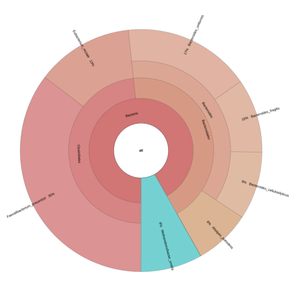
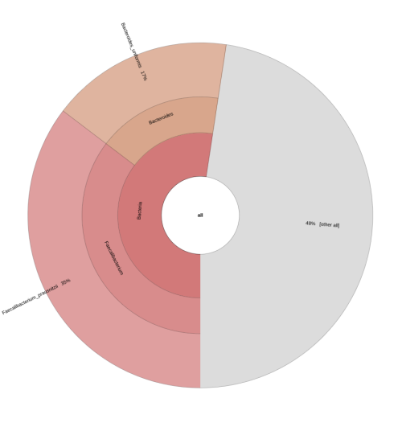
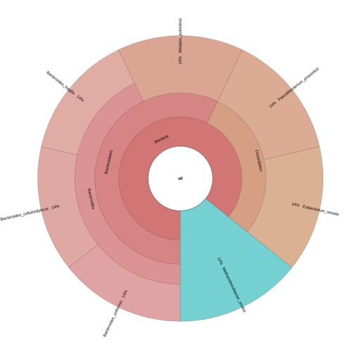

Creates a Krona chart using the [Krona ktImportText](https://github.com/marbl/Krona/tree/master/KronaTools/scripts) function.

# Context

This tool creates self-contained charts to be visualized in web browsers. It combines a variant of radial, space-filling displays with parametric coloring and interactive polar-coordinate zooming. These representations allow for interactive exploration of quantitative results, which is useful when complex hierarchical relationships are involved, for example in [Ecology](https://en.wikipedia.org/wiki/Ecology), where organisms are classified in a [taxonomic hierarchy](https://en.wikipedia.org/wiki/Taxonomic_rank). A critical output of these studies is the estimation of abundances of taxonomical or functional groups. Here Krona provides an intuitive exploration of relative abundances and confidences within the Hierarchical classification. Krona's utility has also been illustrated in [Metagenomics](https://en.wikipedia.org/wiki/Metagenomics) microbial community quantification analyses, offering a rich and interactive display that facilitates the interpretation of results.

Krona's representations can be interpreted as hierarchical [pie charts](https://en.wikipedia.org/wiki/Pie_chart), displaying all hierarchy levels in a single chart. Each level is a circular chart divided into wedge-like sectors, illustrating proportions. In each level, wedges represent a proportionate part of the whole, where the total value is always 100 percent.

# Inputs

## Required inputs

This tool has the following **required** input:

1. **`textFile`**

	Tab-delimited file. The first column generally contains numeric values representing the numeric contribution of the group (see the `withQuantityColumn` input). This is followed by tab-separated columns representing a list of wedges to contribute to (starting from the highest hierarchical level).

	**Note:**
	
	- Entries with a quantity column but no annotation or partial annotation of wedges will be grouped together. All of these entries will contribute to the same top level. In case no annotation exists at any level, contribution will be added to the top-level, being tagged as `other all`.

	- If the table does not include a numeric first column all entries will have an equal weight contribution.

	- The numeric column may contain relative or absolute values. Krona will always normalize these values to 100 percent for each level present in the table. This normalization also occurs in the absence of a numeric column.

	- If the same lineage is listed more than once, the values will be added.

	- Lines in the table beginning with the `#` character will be ignored.

Example of a table with a quantity column and wedge annotations representing microbiome taxonomic groups:
```console
21.05733	Bacteria	Firmicutes	Clostridia	Clostridiales	Ruminococcaceae	Faecalibacterium	Faecalibacterium_prausnitzii
10.16161	Bacteria	Bacteroidetes	Bacteroidia	Bacteroidales	Bacteroidaceae	Bacteroides	Bacteroides_uniformis
7.72722	Bacteria	Firmicutes	Clostridia	Clostridiales	Lachnospiraceae	Lachnospiraceae_unclassified	Eubacterium_rectale
5.86778	Bacteria	Bacteroidetes	Bacteroidia	Bacteroidales	Bacteroidaceae	Bacteroides	Bacteroides_fragilis
5.40168	Bacteria	Bacteroidetes	Bacteroidia	Bacteroidales	Bacteroidaceae	Bacteroides	Bacteroides_cellulosilyticus
4.88961	Archaea	Euryarchaeota	Methanobacteria	Methanobacteriales	Methanobacteriaceae	Methanobrevibacter	Methanobrevibacter_smithii
4.47776	Bacteria	Bacteroidetes	Bacteroidia	Bacteroidales	Rikenellaceae	Alistipes	Alistipes_putredinis
```

Example of two entries, the first one is fully annotated and the second is only partially annotated. The contribution of the second entry will be grouped at the *Bacteroidetes* level:
```console
21.05733	Bacteria	Firmicutes	Clostridia	Clostridiales	Ruminococcaceae	Faecalibacterium	Faecalibacterium_prausnitzii
10.16161	Bacteria	Bacteroidetes
```

Example of two entries, the first one is fully annotated and the second is with no wedge annotations. The contribution of the second entry will be grouped at the top level `other all`:
```console
21.05733	Bacteria	Firmicutes	Clostridia	Clostridiales	Ruminococcaceae	Faecalibacterium	Faecalibacterium_prausnitzii
10.16161
```

Example of two entries with no numeric first column, both entries will have an equal weight contribution:
```console
Bacteria	Firmicutes	Clostridia	Clostridiales	Ruminococcaceae	Faecalibacterium	Faecalibacterium_prausnitzii
Bacteria	Bacteroidetes	Bacteroidia	Bacteroidales	Bacteroidaceae	Bacteroides	Bacteroides_uniformis
```


## Optional inputs

This tool provides additional configuration through the following **optional** inputs:

1. **`withQuantityColumn`**

	Set this value to `true` if the first column of the `textFile` input contains numeric values (quantity), otherwise this value should be set to `false` (default: `true`).

2. **`outputPrefix`**

	Prefix for the output file (default: `krona`).

# Outputs

## Required outputs

This tool will **always** provide the following output:

1. **`kronagram`**

	Interactive Krona chart in HTML format. Different examples are available at the official [Krona GitHub Wiki](https://github.com/marbl/Krona/wiki). These are some of them:

	- [Taxonomic abundance](http://marbl.github.io/Krona/examples/rdp.krona.html) of skin microbiome.
	- [Nutrition facts](http://marbl.github.io/Krona/examples/xml.krona.html) for granola.
	- [Disk usage](http://marbl.github.io/Krona/examples/du.krona.html) for a folder.

# Example
## Get input data
Three different versions of a microbiome abundance table will be used as examples, each one of them illustrating a different scenario.

1. The table below contains a quantity column and wedge annotations for microbiome taxonomic groups. Copy the content and save it in a file as `microbiome-abundance.txt`:

```console
21.05733	Bacteria	Firmicutes	Clostridia	Clostridiales	Ruminococcaceae	Faecalibacterium	Faecalibacterium_prausnitzii
10.16161	Bacteria	Bacteroidetes	Bacteroidia	Bacteroidales	Bacteroidaceae	Bacteroides	Bacteroides_uniformis
7.72722	Bacteria	Firmicutes	Clostridia	Clostridiales	Lachnospiraceae	Lachnospiraceae_unclassified	Eubacterium_rectale
5.86778	Bacteria	Bacteroidetes	Bacteroidia	Bacteroidales	Bacteroidaceae	Bacteroides	Bacteroides_fragilis
5.40168	Bacteria	Bacteroidetes	Bacteroidia	Bacteroidales	Bacteroidaceae	Bacteroides	Bacteroides_cellulosilyticus
4.88961	Archaea	Euryarchaeota	Methanobacteria	Methanobacteriales	Methanobacteriaceae	Methanobrevibacter	Methanobrevibacter_smithii
4.47776	Bacteria	Bacteroidetes	Bacteroidia	Bacteroidales	Rikenellaceae	Alistipes	Alistipes_putredinis
```

2. The table below contains a quantity column and wedge annotations for some of the entries. Copy the content and save it in a file as `microbiome-abundance.partial-annotation.txt`:

```console
21.05733	Bacteria	Firmicutes	Clostridia	Clostridiales	Ruminococcaceae	Faecalibacterium	Faecalibacterium_prausnitzii
10.16161	Bacteria	Bacteroidetes	Bacteroidia	Bacteroidales	Bacteroidaceae	Bacteroides	Bacteroides_uniformis
7.72722
5.86778
5.40168
4.88961
4.47776
```

3. The table below contains a list of wedge annotations with no quantity column. Copy the content and save it in a file as `microbiome-abundance.no-quantities.txt`:

```console
Bacteria	Firmicutes	Clostridia	Clostridiales	Ruminococcaceae	Faecalibacterium	Faecalibacterium_prausnitzii
Bacteria	Bacteroidetes	Bacteroidia	Bacteroidales	Bacteroidaceae	Bacteroides	Bacteroides_uniformis
Bacteria	Firmicutes	Clostridia	Clostridiales	Lachnospiraceae	Lachnospiraceae_unclassified	Eubacterium_rectale
Bacteria	Bacteroidetes	Bacteroidia	Bacteroidales	Bacteroidaceae	Bacteroides	Bacteroides_fragilis
Bacteria	Bacteroidetes	Bacteroidia	Bacteroidales	Bacteroidaceae	Bacteroides	Bacteroides_cellulosilyticus
Archaea	Euryarchaeota	Methanobacteria	Methanobacteriales	Methanobacteriaceae	Methanobrevibacter	Methanobrevibacter_smithii
Bacteria	Bacteroidetes	Bacteroidia	Bacteroidales	Rikenellaceae	Alistipes	Alistipes_putredinis
```

## Upload input data into BatchX
Use the following commands to upload these tables to your BatchX filesystem:
```console
bx cp microbiome-abundance.txt bx://test/krona/import-text/
bx cp microbiome-abundance.partial-annotation.txt bx://test/krona/import-text/
bx cp microbiome-abundance.no-quantities.txt bx://test/krona/import-text/
```

## Submit job

### Example 1
Submit a job to create a Krona chart from the `microbiome-abundance.txt` table:

```console
bx submit batchx@bioinformatics/krona/import-text:1.0.7 '{
	"textFile": "bx://test/krona/import-text/microbiome-abundance.txt",
	"outputPrefix": "microbiome-abundance"
}'
```

This job generates the Krona chart shown below, in which the quantity column is used to display the contribution of each wedge annotation:



### Example 2
Submit a job to create a Krona chart from the `microbiome-abundance.partial-annotation.txt` table:

```console
bx submit batchx@bioinformatics/krona/import-text:1.0.7 '{
	"textFile": "bx://test/krona/import-text/microbiome-abundance.partial-annotation.txt",
	"outputPrefix": "microbiome-abundance.partial-annotation"
}'
```

This second job generates the Krona chart shown below, in this case entries from the table with no annotations are grouped together, contributing to the same top level (`other all`):



### Example 3
Submit a job to create a Krona chart from the `microbiome-abundance.no-quantities.txt` table:

```console
bx submit batchx@bioinformatics/krona/import-text:1.0.7 '{
	"textFile": "bx://test/krona/import-text/microbiome-abundance.no-quantities.txt",
	"withQuantityColumn": false,
	"outputPrefix": "microbiome-abundance.no-quantities"
}'
```

This third job generates the Krona chart shown below, since the input table does not include a numeric column all entries display an equal weight contribution in the chart:




# Links

* [Krona manuscript](https://pubmed.ncbi.nlm.nih.gov/21961884/)
* [Krona Wiki](https://github.com/marbl/Krona/wiki)
* [Importing text and XML data](https://github.com/marbl/Krona/wiki/Importing-text-and-XML-data)

# Tool versions
* **KronaTools:** 2.7.1
